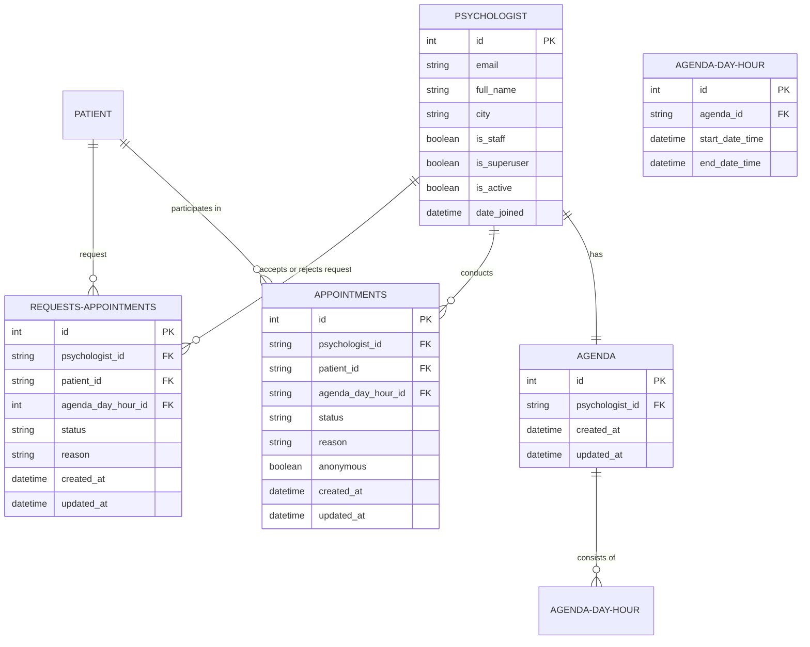

# MindMeet-PADB

## Descrição
O projeto MindMeet-PADB é um aplicativo de gerenciamento de tarefas que permite aos usuários criar e gerenciar tarefas em um quadro. O aplicativo é construído usando o framework FastAPI e o banco de dados PostgreSQL.

## Objetivo da atividade
O objetivo deste projeto é fornecer uma plataforma para agendamento de teleconsultas entre psicólogos e clientes. O sistema permite que os usuários adicionem ou removam agendamentos do banco de dados.

## UML

## References 
- https://www.psycopg.org/psycopg3/docs/index.html
- https://docs.pydantic.dev/latest/
- https://fastapi.tiangolo.com/

- https://www.postgresqltutorial.com/postgresql-tutorial/postgresql-identity-column/
